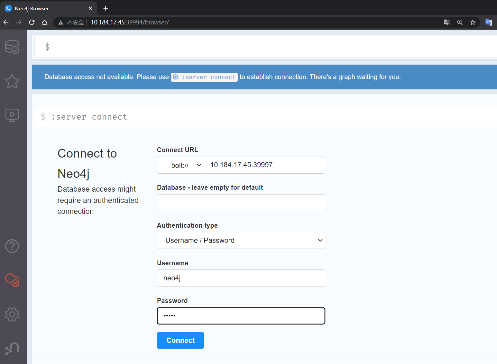
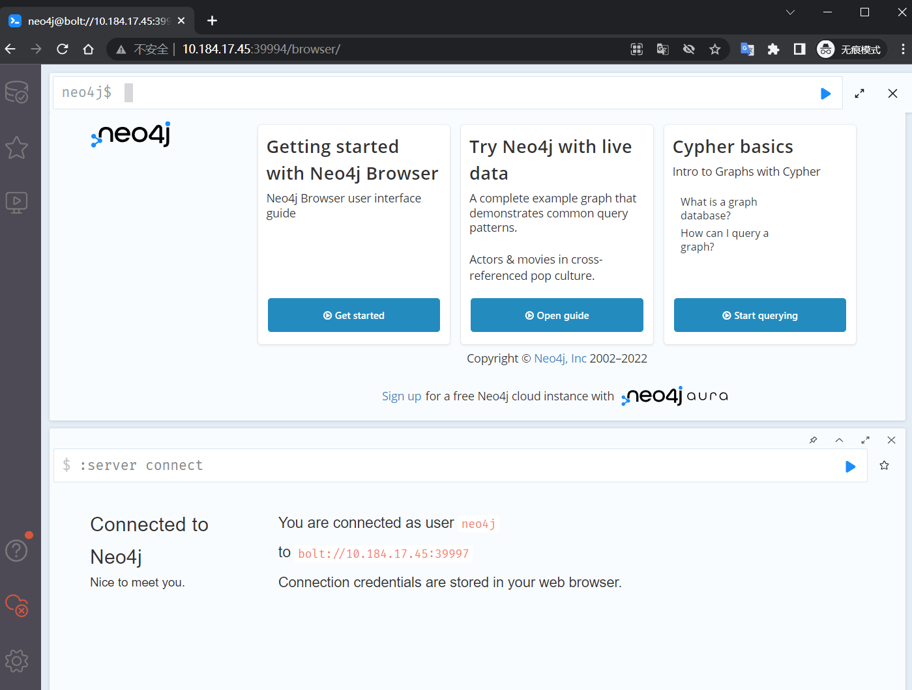
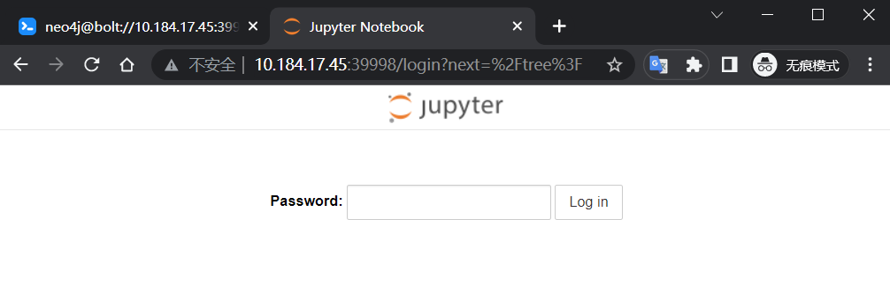
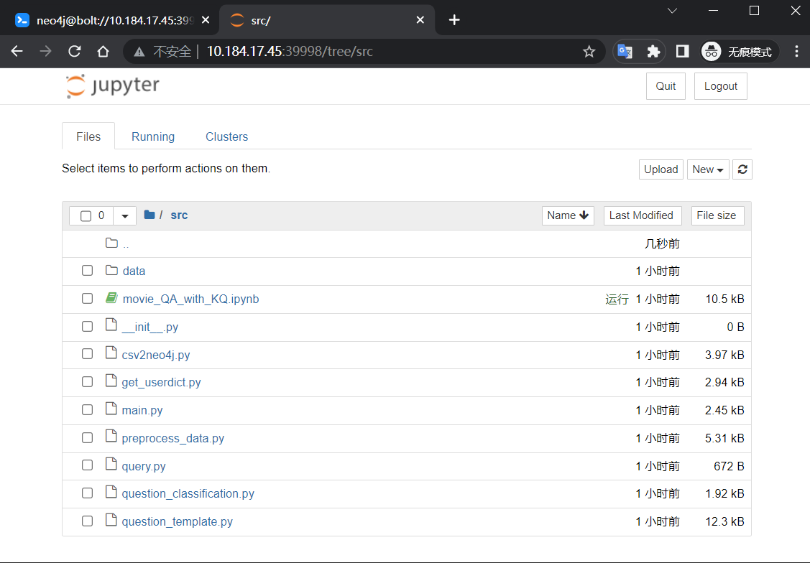
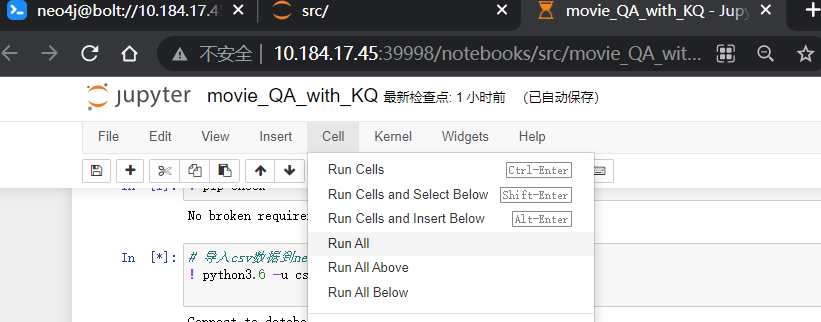
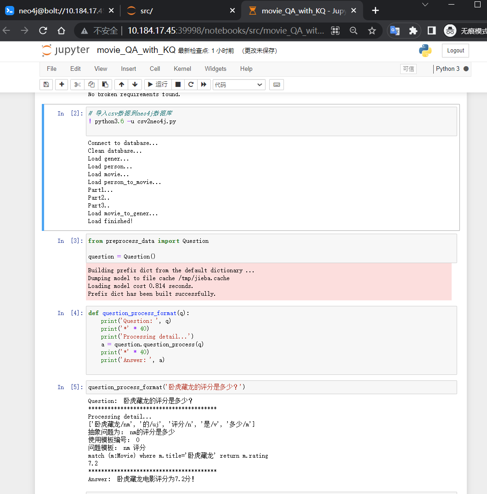

# 基于neo4j和模板匹配的kbqa

## 来源

- 仓库 fork 自 [hlnn](https://github.com/hlnn) 的 https://github.com/HLNN/NLP/tree/master/Final
- 添加了 docker 配置镜像的部分
- 新增 jupter 服务器配置部分

## 运行说明
 (注: 以下是校园内网环境下配置, 本地运行请自行修改相应端口)
- 整体运行流程是:
  1. 构建 neo4j 数据库, python3.6+jupyter-notebook 的环境, 启动neo4j和jupyter
  2. 访问 neo4j 网页, 修改默认密码
  3. 访问 jupyter 服务器, 运行demo, 导入数据库, 初始化模板分类器, 知识库问答

### 下载

- 下载仓库

  ```shell
  git clone ...
  cd ./kbqa-neo4j/Final
  ```

- 下载 [neo4j-community-4.4.6-unix.tar.gz]( https://dist.neo4j.org/neo4j-community-4.4.6-unix.tar.gz), 国内镜像: [www.we-yun.com/neo4j](https://we-yun.com/doc/neo4j/4.4.6/neo4j-community-4.4.6-unix.tar.gz), 放在`./kbqa-neo4j/Final`文件夹下

  ```shell
  cd ./kbqa-neo4j/Final
  wget https://dist.neo4j.org/neo4j-community-4.4.6-unix.tar.gz
  ```

### 创建镜像 

```shell
# 创建镜像
docker build  -f "Dockerfile" -t kbqa:neo4j-v1.0 .

# 创建容器, 并启动, 7474:http端口; 7687:neo4j或bolt协议端口; 8888:jupyter端口
docker run -deteach -p 39994:7474 -p 39997:7687 -p 39998:8888 --interactive --tty --name kbqa-neo4j-v1.0 kbqa:neo4j-v1.0

# 进入容器 (不进入也可)
docker exec -ti kbqa-neo4j-v1.0 /bin/bash
```

### 修改neo4j初始密码

- 访问数据库服务器主页http://10.184.17.45:39994/, 初始账号`neo4j`, 密码`neo4j`, **密码改为`kbqa `**

- **Connect URL** 连接改为 **bolt://**

- 输入账号密码连接

  

- 连接成功

   

### 访问jupyter, 导入数据到neo4j, 运行kbqa示例

- 访问jupter主页: http://10.184.17.45:39994/, **默认密码为:`jupyter`**

  

  ----

- 访问 [src](http://10.184.17.45:39998/tree/src) 文件夹

  

- 进入 [movie_QA_with_KQ.ipynb](http://10.184.17.45:39998/notebooks/src/movie_QA_with_KQ.ipynb), 运行全部cell

  

- 等待程序结束, 查看结果

  
