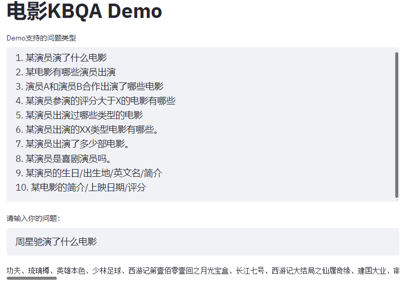

# 基于neo4j知识图谱的KBQA

整理后部署在69服务器的docker容器中: [neo4j数据库](http://10.184.17.45:39994/browser/), [jupyter demo](http://10.184.17.45:39998/notebooks/src/movie_QA_with_KQ.ipynb)

github代码: [基于neo4j和模板匹配的kbqa](https://github.com/hhqx/kbqa-neo4j)

# 基于知识图谱的KBQA-demo, 来自: [SimmerChan-ZJU](https://github.com/SimmerChan/KG-demo-for-movie)

整理后运行在69服务器的docker容器中: [demo链接](http://10.184.17.45:39990/)

具体docker配置和运行说明, 放在github: [hhqx](https://github.com/hhqx/kbqa-jena)

## KBQA基本流程

### 1. 输入查询问题, 基于jieba进行分词和实体识别

### 2. 利用REfO(Regular Expressions for Objects)的语义匹配

利用正则表达式进行模板匹配

### 3. 调用预先定义好的SPARQL查询命令, 打印结果

这里查询的是RDF(Resource Description Framework)服务器(Fuseki), 查询语言是SPARQL

# 构建电影知识图谱 -- 基于Apache Jena

## 知识图谱相关概念

### RDF

RDF(Resource Description Framework)，即资源描述框架，其本质是一个数据模型（Data Model）

- 由节点和边组成，**节点表示实体**/资源、属性，**边表示关系**

- 表达能力有限，**无法区分节点是类还是对象**，也无法定义和描述类的关系/属性。

### SPARQL

SPARQL是SPARQL Protocol and RDF Query Language的递归缩写，专门用于访问和操作RDF数据，是语义网的核心技术之一.

### RDFS 和 OWL

RDF的“衣服”: RDFS, OWL; 它们都是用来描述RDF数据的, 在RDF基础上定义了新的词汇.

- **RDFS(Resource Description Framework Schema)**, 即资源描述框架模式, 是一种模式语言. 

  - 相比于RDF, 主要新增了**类节点的定义**, **类与类的关系**, **类节点与属性节点的关系**:
    1. 类的定义: ` rdfs:Class.`, 
    2. 类与类的关系: `rdfs:subClassOf.`描述类的父类
    3. 属性与类的关系: `rdfs:domain.`描述属性属于哪个类别
    4. 属性的父属性: `rdfs:subProperty.`, 属性的取值类型: `rdfs:range.`

- **OWL(Web Ontology Language)**, 即网络本体语言,可以把OWL当做**是RDFS的一个扩展**

  - 例如增加了**描述属性特征**的词汇, 更高一层的抽象, 可以描述关系的关系

    1. `owl:TransitiveProperty.` 表示该属性具有传递性质。例如，定义“位于”是具有传递性的属性，若A位于B，B位于C，那么A肯定位于C。

    2. `owl:SymmetricProperty.`表示该属性具有对称性。例如，定义“认识”是具有对称性的属性，若A认识B，那么B肯定认识A。
    3. **利用关系的关系**, 可以对**推理补全关系**

  - 新增本体映射词汇(Ontology Mapping), 主要用于融合多个独立的Ontology/Schema

## Apache Jena 简介

Apache Jena（简称Jena），是一个开源的Java语义网框架

1. TDB是Jena用于存储RDF的组件

2. Jena提供了RDFS、OWL和通用规则推理机。这个demo中使用的是**基于OWL的规则推理机**
3. 提供了D2RQ, 提供了关系数据库到RDF的转换
   - 可以**以虚拟RDF的方式来访问RDB(关系数据库)中的数据**
   - 给定本体定义, RDB的表到RDF的本体之间的映射, 可以根据映射**将关系数据库导出为RDF数据**
4. Fuseki是Jena提供的SPARQL服务器, 用SPARQL可以查询RDF数据

## 自顶向下构建知识图谱demo

### 本体构建

利用protege自顶向下地构建自己的本体结构。

生成本体文件: `ontology.ttl`

### 下载电影数据存入关系数据库

python环境下, 调用`requests`包下载"The Movie DB"网站的数据, 调用`pymysql`包将数据存到关系数据库

### RDB2RDF

1. 编写关系数据库表到RDF本体的映射文件: `kg_demo_movie_mapping.ttl`

2. 利用Jena的Fuseki服务器, 将数据库导出为RDF数据文件(三元组格式): `kg_demo_movie.nt`

### 关系补全

- 构建OWL规则文件: `rules.ttl`

- 使用`“tdbloader.bat”`将之前的RDF数据:`kg_demo_movie.nt`以TDB格式存储, TDB格式是Jena的一种RDF格式
- 启动Jena的OWL推理机, **进行知识图谱的推理**(基于本体的推理)

### 初步完成知识图谱的构建

后续可转移到图数据库neo4j

# KQBA与知识图谱的接口

对于 KQBA demo 启动Jena的Fuseki服务器, 监听SPARQL查询请求, 并返回查询结果

